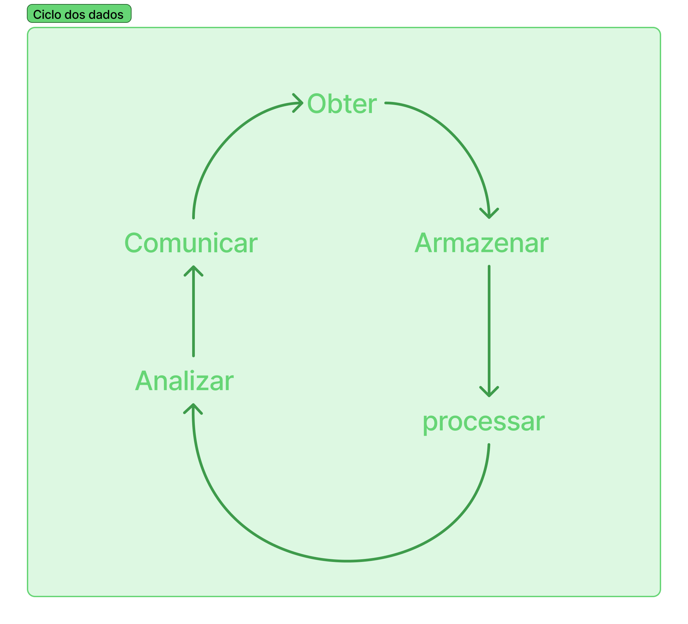

# Introdução à Ciência de Dados

A Ciência de Dados é uma área que combina conhecimentos de estatística, matemática, programação e inteligência artificial para analisar grandes volumes de dados e extrair informações úteis. Essas informações ajudam empresas e organizações a tomar decisões mais inteligentes e baseadas em fatos.

Segundo a IBM, a ciência de dados é uma prática que busca resolver problemas complexos e encontrar insights acionáveis para negócios através da análise de dados avançada, a qual combina técnicas de matemática, estatística, programação, inteligência artificial (IA) e aprendizado de máquina.

## Ciclo de Vida da Ciência de Dados
O processo de ciência de dados geralmente segue estas etapas:

- **Coleta de Dados**: Reunir dados de diversas fontes, como bancos de dados, redes sociais, sensores, entre outros.

- **Armazenamento e Processamento**: Organizar e preparar os dados para análise, o que pode incluir limpeza e transformação dos dados.

- **Análise de Dados**: Explorar os dados para identificar padrões e tendências.

- **Modelagem**: Aplicar algoritmos de aprendizado de máquina para fazer previsões ou classificações.

- **Comunicação dos Resultados**: Apresentar os insights de forma clara, usando visualizações e relatórios, para auxiliar na tomada de decisões.

## O Papel do Cientista de Dados
O Cientista de Dados é o profissional que conduz esse processo. Suas responsabilidades incluem: Entender o problema de negócio e formular perguntas relevantes, coletar e preparar os dados para análise, aplicar técnicas estatísticas e de aprendizado de máquina, interpretar os resultados e comunicar os insights de forma clara.

## Aplicações da Ciência de Dados
A ciência de dados é utilizada em diversas áreas, como:

- **Saúde**: Para prever surtos de doenças ou personalizar tratamentos.

- **Finanças**: Para detectar fraudes e avaliar riscos de crédito.

- **Varejo**: Para entender o comportamento do consumidor e otimizar estoques.

- **Transporte**: Para melhorar rotas e prever demandas.

<!-- ## Ferramentas Comuns
Algumas das ferramentas e linguagens de programação mais utilizadas em ciência de dados são:

Python: Linguagem de programação com diversas bibliotecas para análise de dados.

R: Linguagem focada em estatística e visualização de dados.

Pandas: Biblioteca Python para manipulação de dados.

Matplotlib e Seaborn: Bibliotecas Python para criação de gráficos.

Jupyter Notebook: Ambiente interativo para escrever e executar código. -->

A ciência de dados é uma área em crescimento que permite transformar dados brutos em informações valiosas. Com as ferramentas e técnicas adequadas, é possível descobrir insights que podem melhorar processos, produtos e serviços em diversas indústrias.

